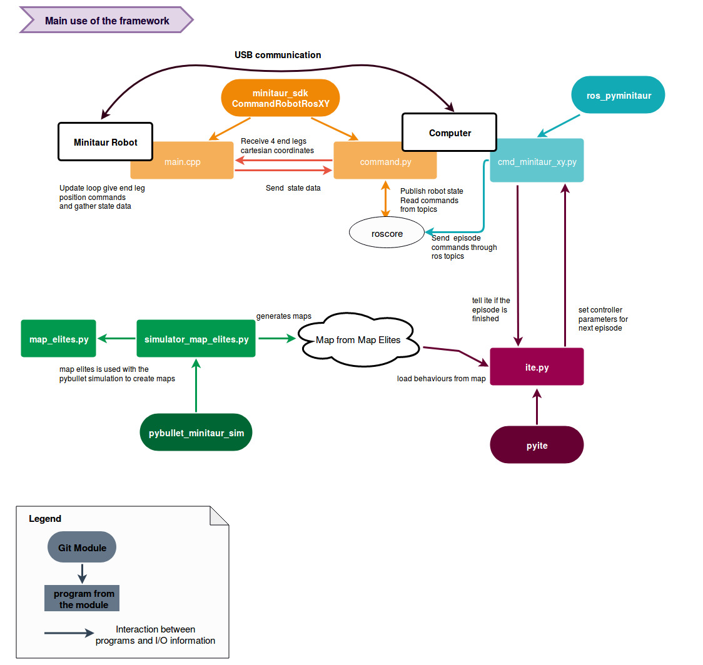

Git Guide
==========

*****
Github description
*****

The Resibots's Git gathers usefull code for resibots's experiments.
This repository contains everything needed to reproduce resibot's experiments and more.

Here, it explains how the Git repository is organized. There are **67** repositories at the moment.

`Limbo <https://github.com/resibots/limbo>`__
#############################################

  * `ite_v2 <https://github.com/resibots/ite_v2>`__ : Limbo experiment, IT&E code for developing hexapod experiments similar to `Cully et al. (2015), Nature <https://www.nature.com/articles/nature14422>`__

  * `blackdrops <https://github.com/resibots/blackdrops>`__ : Limbo experiment, The Black-DROPS algorithm is a model-based policy search algorithm

`Sferes2 <https://github.com/sferes2>`__
########################################

  * `map_elites_hexapod_v2 <https://github.com/resibots/map_elites_hexapod_v2>`__ MAP-Elites code for hexapod experiments

Dynamixel
#########

* `libdynamixel <https://github.com/resibots/libdynamixel>`__ libdynamixel is a C++ interface to the dynamixel actuators

* `dynamixel_control_hw <https://github.com/resibots/dynamixel_control_hw>`__ provides a hardware interface for ROS control and dynamixel actuators

Hexapod repository
##################

* `hexapod_common <https://github.com/resibots/hexapod_common>`__ This repository contains hexapod controllers (generic controller) and hexapod models (urdf files)
* `hexapod_simu <https://github.com/resibots/hexapod_simu>`__
    * `hexapod_dart` DART integration for our hexapods
    * `hexapod_robdyn` `robdyn <https://github.com/resibots/robdyn>`__ integration for our hexapods
* `hexapod_ros <https://github.com/resibots/hexapod_ros>`__ these packages are for ROS integration
    * `hexapod_bringup` : launch file for the hardware interface
    * `hexapod_description` : Xacro for hexapod, as well as relevant launch files for the description
    * `hexapod_driver` : C++ API to control our hexapods (talks to dynamixel_control through trajectory messages)
    * `hexapod_ros` : metapackage for the above packages
* `hexapo_ik <https://github.com/resibots/hexapod_ik>`__ : (ROS-ready) library to use inverse kinematics on our hexapods
* `pexod-mechanical-design <https://github.com/resibots/pexod-mechanical-design>`__ hosts the `openSCAD <https://www.openscad.org/>`__ files for the springed-leg of the hexapod
* `optoforce <https://github.com/resibots/optoforce>`__ contains ROS packages for the USB version of the Optoforce sensor

Minitaur repository
#########################

* `minitaur_framework <https://github.com/resibots/minitaur_framework>`__

  * `minitaur_sdk <https://github.com/resibots/minitaur_sdk>`__ - The minitaur ghost robotics sdk with some custom examples to be able to read and send commands from ROS and though USB
  * `ros_pyminitaur <https://github.com/resibots/ros_pyminitaur>`__ - The ros package with everything needed to read maps created with Map Elites and send the commands to the minitaur through ros
  * `pybullet_minitaur_sim <https://github.com/resibots/pybullet_minitaur_sim>`__ - This contains a pybullet minitaur simulation based on this github repository . The pybullet_minitaur_sim defines everything needed to run episodes and create maps with Map Elites.
  * `pyite <https://github.com/resibots/pyite>`__ - An IT&E implementation in python, it can be used with pybullet for simulation or with ros to send commands to the real robots. It is selecting the best behaviors in the maps created with Map Elites thanks to a bayesian optimization process
  * `pycontrollers <https://github.com/resibots/pycontrollers>`__ This repository stores python robot controllers
  * `pymap_elites <https://github.com/resibots/pymap_elites/tree/master>`__

Youbot repository
#################

* `youbot_driver <https://github.com/resibots/youbot_driver>`__ youbot API
* `youbot_driver_ros_interface <https://github.com/resibots/youbot_driver_ros_interface>`__ Interface classes for ROS to the youBot driver.
* `omni_common <https://github.com/resibots/omni_common>`__ contains all the data/code for our omnidirectional robots that is common to simulation and the real robot. Therefore, there is no dependency on ROS.
* `youbot_description <https://github.com/resibots/youbot_description>`__ Robot description in form of URDF files and meshes
* `omni_simu <https://github.com/resibots/omni_simu>`__ contains all the available simulator integrations for our omnidirectional robots
* `omni_ros <https://github.com/resibots/omni_ros>` ROS Integration for our ommidirectional robots
* `teleop_youbot <https://github.com/resibots/teleop_youbot>`__  ROS package contains the launch file and configuration file for a logitech F710 joypad to control the YouBot base
* `versaball_ros <https://github.com/resibots/versaball_ros>`__ Control the Versaball for our Omnigrasper robot.
* `omnigrasper_mechanical_design <https://github.com/resibots/omnigrasper_mechanical_design>`__ hosts the openSCAD files for the different pieces used on the Omnigrasper

Simulation
##########

* `DART <https://github.com/resibots/dart>`__ Dynamic Animation and Robotics Toolkit
* `Robdyn <https://github.com/resibots/robdyn>`__ simple C++ wrapper around ODE
* `PyBullet <https://github.com/bulletphysics/bullet3/tree/master/examples/pybullet>`__ simple Python simulator

code related to papers
######################

* `cully_2015_nature  <https://github.com/resibots/cully_2015_nature>`__ WARNING This repository is for archival-purpose only. A more up-to-date implementation of IT&E as described in Cully et al., 2015 is available `here <https://github.com/resibots/ite_v2>`__
* `tarapore_2016_gecco <https://github.com/resibots/tarapore_2016_gecco>`__ Source code for the GECCO paper 'How do different encodings influence the performance of the MAP-Elites algorithm?'
* `vassiliades_2017_cvt_map_elites <https://github.com/resibots/vassiliades_2017_cvt_map_elites>`__ Scaling Up MAP-Elites Using Centroidal Voronoi Tessellations
* `kaushik_2018_multi-dex <https://github.com/resibots/kaushik_2018_multi-dex>`__ Source code for "Multi-objective Model-based Policy Search for Data-efficient Learning with Sparse Rewards" (CoRL 2018)
* `vassiliades_2018_gecco <https://github.com/resibots/vassiliades_2018_gecco>`__ Source code for Discovering the Elite Hypervolume by Leveraging Interspecies Correlation (GECCO 2018)
* `rieffel_mouret_2018_soft_tensegrity <https://github.com/resibots/rieffel_mouret_2018_soft_tensegrity>`__ Source code for ``Adaptive and Resilient Soft Tensegrity Robots'' (Soft Robotics, 2018)
* `chatzilygeroudis_2018_rte <https://github.com/resibots/chatzilygeroudis_2018_rte>`__ Reset-free Trial-and-Error Learning for Robot Damage Recovery
* `pautrat_2018_mlei <https://github.com/resibots/pautrat_2018_mlei>`__ Bayesian Optimization with Automatic Prior Selection for Data-Efficient Direct Policy Search

Tools
#####

* `simple_nn <https://github.com/resibots/simple_nn>`__ a lightweight, generic and easy to use C++11 library for feedforward neural networks
* `mcts <https://github.com/resibots/mcts>`__ Monte Carlo Tree Search
* `libcmaes <https://github.com/resibots/libcmaes>`__  is a multithreaded C++11 library with Python bindings for high performance blackbox stochastic optimization using the CMA-ES algorithm for Covariance Matrix Adaptation Evolution Strategy
* `cvt <https://github.com/resibots/cvt>`__ C++ and Python code for creating a Centroidal Voronoi Tessellation
* `libgp <https://github.com/resibots/libgp>`__ fork of libgp for benchmark purposes. If you need a library for Gaussian processes, please use `Limbo <https://github.com/resibots/limbo>`__ , which is more flexible and actively maintained by our group

Others
######

* `robot_dart <https://github.com/resibots/robot_dart>`__ This repo contains a generic wrapper around the DART simulator.
* `ros_control_loop <https://github.com/resibots/ros_control_loop>`__ This is a generic, but basic, control loop for ros_control.
* `esp8266-estop <https://github.com/resibots/esp8266-estop>`__ wifi emergency stop built with the esp8266 wifi + microcontroller
* `estop-wachtdog <https://github.com/resibots/estop-watchdog>`__ ROS-enabled emergency-stop
* `estop-gateway <https://github.com/resibots/estop-gateway>`__ take messages sent by a network-based emergency stop device
* `teleop_tools <https://github.com/resibots/teleop_tools>`__  A set of generic teleoperation tools for any robot
* `phidgets_driver-1 <https://github.com/resibots/phidgets_drivers-1>`__ Drivers for the Phidgets devices
* `phidgets_drivers <https://github.com/resibots/phidgets_drivers>`__ Drivers for the Phidgets devices.
* `phidget_textlcd <https://github.com/resibots/phidget_textlcd>`__
* `logos <https://github.com/resibots/logos>`__ resibots logos
* `sphinxcontrib-versioning <https://github.com/resibots/sphinxcontrib-versioning>`__
* `sphinx_resibots_theme <https://github.com/resibots/sphinx_resibots_theme>`__  View our `website <resibots.eu>`__ to see how this theme looks
* `Metabot <https://github.com/resibots/Metabot>`__ Metabot is an open-source DIY quadruped robotics platform
* `hexa_control <https://github.com/resibots/hexa_control>`__ no longer use nor develop this software, please refer to `dynamixel_control_hw <https://github.com/resibots/dynamixel_control_hw>`__ and `hexapod_ros <https://github.com/resibots/hexapod_ros>`__ /hexapod_driver for newer software used for our hexapods.
* `dynamixel_control <https://github.com/resibots/dynamixel_control>`__ no longer use nor develop, please refer to `dynamixel_control_hw <https://github.com/resibots/dynamixel_control_hw>`__
* `simple_walk <https://github.com/resibots/simple_walk>`__  made a basic tripod gait for our hexapods. No longer use nor develop.
* `format_code <https://github.com/resibots/format_code>`__ helps us keep our C++ source files in a uniform look on all our repositories
* `mocap_optitrack <https://github.com/resibots/mocap_optitrack>`__ ROS nodes for working with the NaturalPoint Optitrack motion capture setup
* `ITE <https://github.com/resibots/ITE>`__ OLD, please refer to version 2 `ite_v2 <https://github.com/resibots/ite_v2>`__
* `map_elites_hexapod <https://github.com/resibots/map_elites_hexapod>`__ OLD, please refer to version 2 `map_elites_hexapod_v2 <https://github.com/resibots/map_elites_hexapod_v2>`__
* `icun_crawling_v2 <https://github.com/resibots/icub_crawling_v2>`__ New implementation of crawling for the iCub robot
* `resibots_lauch <https://github.com/resibots/resibots_launch>`__ This package contains launch and configurations files concerning experiments of the ResiBots project **old** (only use for launch vrpn server)

 Actually, there are two main framework :
 Hexapod and Quadruped

*******************
 Hexapod framework
*******************

.. image:: pics/low_res/framework_hexapod_.png
   :alt: 6-legged robot
   :target: _static/mid_res/framework_hexapod_.png
   :align: center

This framework contains everything needed to use IT&E and Map-Elites with the hexapod based-on dynamixel actuators. It includes the followings :

  * `libdynamixel <https://github.com/resibots/libdynamixel>`__  is a C++ interface to the dynamixel actuators
  * `dynamixel_control_hw <https://github.com/resibots/dynamixel_control_hw>`__ provides a hardware interface for ROS control and dynamixel actuators
  * `hexapod_common <https://github.com/resibots/hexapod_common>`__ contains hexapod controllers (generic controller) and hexapod models (urdf files)
  * `hexapod_simu <https://github.com/resibots/hexapod_simu>`__ hexapod DART simulation
  * `hexapod_ros <https://github.com/resibots/hexapod_ros>`__ are for ROS integration :
      * `hexapod_bringup`: **launch** and **config** file for `dynamixel_control_hw <https://github.com/resibots/dynamixel_control_hw>`__
      * `hexaopod_description` : urdf and xacro files
      * `hexapod_controllers` : homemade ROS controllers
      * `hexapod_driver` : ITE experiment
  * `Limbo <https://github.com/resibots/limbo>`__
      * `ite_v2 <https://github.com/resibots/ite_v2>`__ : Limbo experiment, IT&E code for developing hexapod experiments similar to `Cully et al. (2015), Nature <https://www.nature.com/articles/nature14422>`__
      * `blackdrops <https://github.com/resibots/blackdrops>`__ : Limbo experiment, The Black-DROPS algorithm is a model-based policy search algorithm
  * `Sferes2 <https://github.com/sferes2>`__
      * `map_elites_hexapod_v2 <https://github.com/resibots/map_elites_hexapod_v2>`__ MAP-Elites code for hexapod experiments

*******************
 Minitaur framework
*******************

* `minitaur_framework <https://github.com/resibots/minitaur_framework>`__

This framework contains everything needed to use IT&E and Map-Elites with the minitaur from ghost robotics. It includes the followings :

    * `minitaur_sdk <https://github.com/resibots/minitaur_sdk>`__ - The minitaur ghost robotics sdk with some custom examples to be able to read and send commands from ROS and though USB

    * `ros_pyminitaur <https://github.com/resibots/ros_pyminitaur>`__ - The ros package with everything needed to read maps created with Map Elites and send the commands to the minitaur through ros

    * `pybullet_minitaur_sim <https://github.com/resibots/pybullet_minitaur_sim>`__ - This contains a pybullet minitaur simulation based on this github repository . The pybullet_minitaur_sim defines everything needed to run episodes and create maps with Map Elites.

    * `pyite <https://github.com/resibots/pyite>`__ - An IT&E implementation in python, it can be used with pybullet for simulation or with ros to send commands to the real robots. It is selecting the best behaviors in the maps created with Map Elites thanks to a bayesian optimization process
