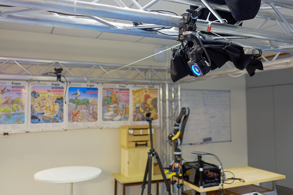
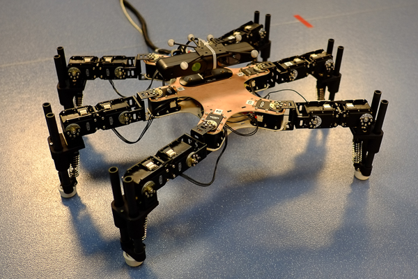
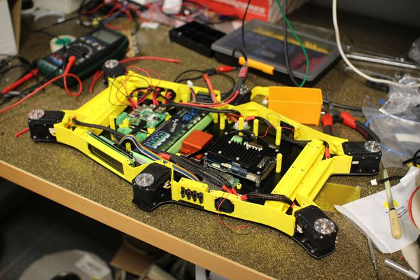
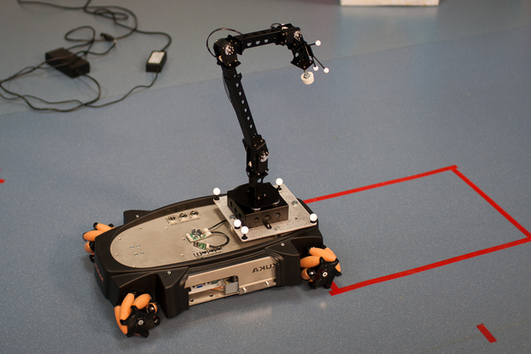

Lab & Robots (photos)
=====================

Check also the :doc:`videos`.

The lab @ Inria Nancy
----------------------

.. image:: pics/low_res/c104_full.jpg
  :alt: room C104 (experimental room)
  :target: _static/mid_res/c104_full.jpg
  :align: center

Our main experimental room contains a 5.5 x 6 m experimental 'arena' made with aluminium trusses. It is equipped with:

- a 6D motion capture system (Optitrack), with 8 gibagit cameras (Prime 13);
- 4 high-power, studio lights;
- 3 mobile 19'' racks (on wheels), which host the power supplies and the computers to control the robots;

The trusses support the motion capture system and the lights, and hold all the cables (network, 220V, etc.).

Robots
--------
Click on each image to see it bigger.

6-legged robot
^^^^^^^^^^^^^^

.. image:: pics/low_res/hexapod_arena.jpg
  :alt: 6-legged robot
  :target: _static/mid_res/hexapod_arena.jpg
  :align: center

The last version of our 6-legged robot, which was featured on the cover of Nature (see :doc:`publications`). Videos are available on the :doc:`videos` page. This 6-legged robot is made with 18 MX-28 dynamixel actuators, a Xsens Mti-30 IMU, and a Asus x-tion (RGB-D sensor / Kinect). The silver spheres on top of the x-tion are for the motion tracking.

This robot is a demonstrator and a testbed for our adaptation algorithms. It has no direct intended application, but the *algorithms* that we test with it have appplications.

Creadapt robot (wheel-leg hybrid)
^^^^^^^^^^^^^^^^^^^^^^^^^^^^^^^^^

.. image:: pics/low_res/other_robots.jpg
   :alt: 6-legged robot
   :target: _static/mid_res/other_robots.jpg
   :align: center

.. image:: pics/low_res/creadapt_isir.jpg
  :alt: 6-legged robot
  :target: _static/mid_res/creadapt_isir.jpg
  :align: center

The Creadapt robot is wheel-leg hybrid robot that was developped in a previous project (ANR `Creadapt <http://www.creadapt.net>`_). It is bigger than our 6-legged robot, and it has many more ways to move (drive, walk, ...).

Kuka YouBot + Versaball
^^^^^^^^^^^^^^^^^^^^^^^^^

The YouBot is an omnidirectionnal robot manufactured by Kuka. We are modifying it to use the Versaball gripper (Empire Robotics).

iCub
^^^^^

.. image:: pics/icubcrawl.jpg
  :alt: icub
  :align: center

iCub is a child-like humanoid robot with 54 actuated degrees of freedom, force torque sensors, and a sensitive skin. We use it to test our algorithms for 4-legged crawling and 2-legged walking.
