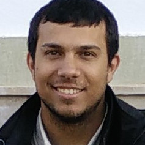

Team
============

Current team
--------------

Jean-Baptiste Mouret
^^^^^^^^^^^^^^^^^^^^^^^^
.. image:: pics/jbm.jpg
   :width: 100 px
   :alt: JB Mouret
   :align: left

- Researcher at `Inria <http://www.inria.fr>`_ (team `LARSEN <http://team.inria.fr/larsen>`_).
- Principal investigator of the project
- [`Personal webpage <http://pages.isir.upmc.fr/~mouret/>`_]

  |

Vassilis Vassiliades
^^^^^^^^^^^^^^^^^^^^^^^^
.. image:: pics/vassilis_vassiliades.png
   :width: 100 px
   :alt: Vassilis Vassiliades
   :align: left

- Post-doc
- [`Personal webpage <https://www.researchgate.net/profile/Vassilis_Vassiliades>`_]

  |
  |

Konstantinos Chatzilygeroudis
^^^^^^^^^^^^^^^^^^^^^^^^

- PhD student, supervised by Jean-Baptiste Mouret

  |
  |
  |

Dorian Goepp
^^^^^^^^^^^^^^^^^^^^^^^^
.. image:: pics/dgoepp.jpg
   :width: 100 px
   :alt: Dorian Goepp
   :align: left

- Robotics Engineer

  |
  |
  |

Current Master Students
^^^^^^^^^^^^^^^^^^^^^^^^
- **Roberto Rama** / Argentina

Alumni
----------
- [2016] **Vaios Papaspyros** / Univ. of Patras (Greece)
- [2016 / L3] **Jules Kozolinsky** / ENS Cachan
- [2016 / master student] **Federico Allocati** / Argentina
- [2015 / master student] **Omar Samir Mohammed** / Machine Learning and Data Mining (MLDM) MSc student / Université Jean Monnet - University of Alicante

Other collaborators
-------------------
- `Antoine Cully <http://pages.isir.upmc.fr/~cully/website/>`_ (post-doc @ Imperial College, UK)
- `Danesh Tarapore <https://pure.york.ac.uk/portal/en/researchers/danesh-sarosh-tarapore(58b2cda2-5ff5-4257-adee-58f44d761452).html>`_ (Marie Curie fellow, University of York, UK)
- `Jeff Clune <http://www.jeffclune.com>`_ (assistant professor @ University of Wyoming, USA)
